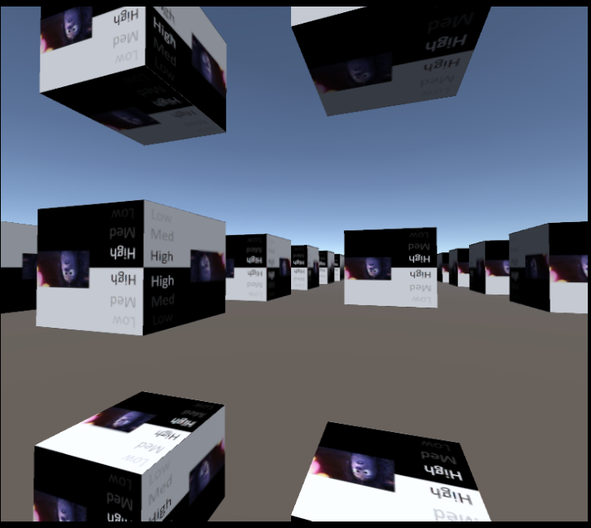

# [DebugScenes](./../DemoScenes.md).BoxWorld

*位于 Packages/YVR Core/Scenes/BoxWorld.scene*

---

BoxWorld 场景是最基本的场景，它用于说明手柄和头部的 6DoF 追踪状态。

> [!NOTE]
> BoxWorld 场景是某种最小的场景，用于测试 SDK 的渲染功能。如果这个场景无法使用，在大多数情况下，项目的设置存在一些错误。

