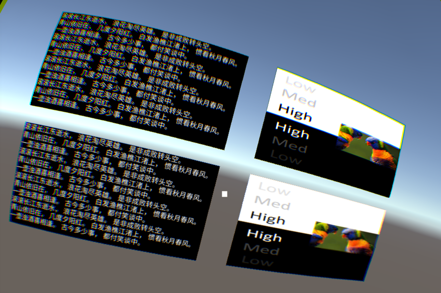
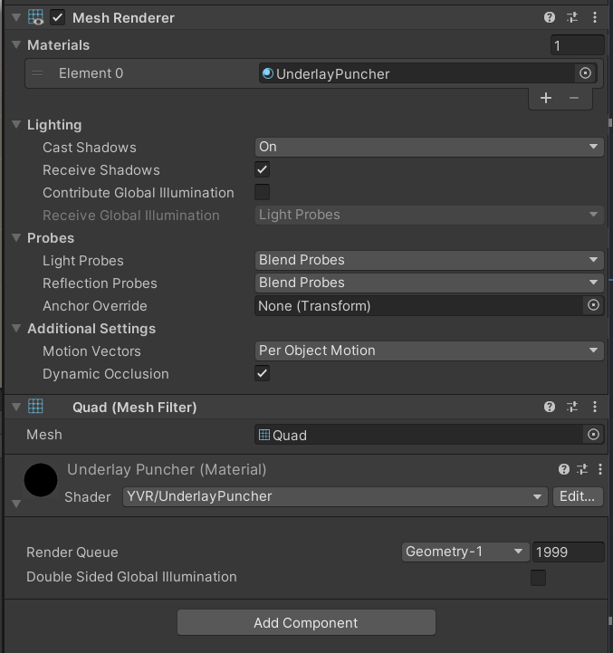

# [DebugScene](../DemoScenes.md).Composite Layer

*位于 YVR/Scenes/CompositeLayer/CompositeLayer.scene*

* 另请参见：
  * [YVRCompositeLayer](xref:YVR.Core.YVRCompositeLayer)

---

CompositeLayer 场景是用来说明合成层效果的。合成层的设计是为了提高平面 UI 的清晰度。在传统的渲染管道中，UI 纹理必须首先被渲染到 Unity 管理的颜色缓冲区，然后 Unity 管理的颜色缓冲区将被渲染到屏幕缓冲区。而使用合成层时，目标 UI 纹理可以直接由本地渲染。因此，可以减少由采样引起的失真。

在 YVR 设备上运行 CompositeLayer 场景时的屏幕截图如下：

> [!CAUTION]
> 由于合成层是由 YVR 设备的原生系统渲染的，所以内容不能在 Unity 编辑器中显示。

下面的部分是由 Unity Eye Buffer 渲染的界面，上面的部分是用合成层渲染的。左边的部分是动态纹理，右边的部分是静态纹理。

使用合成层（上部）和 Unity Eye Buffer（下部）渲染的详细区别如下：

> [!CAUTION]
> 在细节图像中可以看到一些色散，这是为抵消镜头造成的色散而产生的。因此，在使用设备时，不会看到所有的色散.

## Underlay vs Overlay

由于原生系统需要对多个图层进行合成，因此需要知道所有图层的顺序。这个顺序是由合成层的深度决定的，Unity Eye Buffer 的深度被设置为 0。而所有深度大于 0 的层被称为 Overlay，而深度小于 0 的层被称为 Underlay。

底层将首先被绘制，然后是 Unity Eye Buffer，最后是 Overlay。因此，Unity Eye Buffer 将覆盖 Underlay，而 Overlay 将覆盖 Eye Buffer。

为了让 Underlay 正常显示，而不是被完全覆盖，需要在 Unity Eye Buffer 中开一个孔。着色器 `YVR/UnderlayPuncher` 被设计用来生成这样的孔： 

> [!TIP]
> 示例场景中左上角的图层是底层。