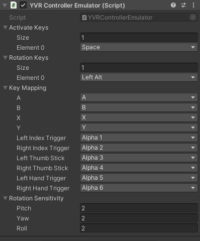

# HMD/Controller Emulator

HMD/Controller Emulator are tools that allow you to use a keyboard and mouse to simulate the behaviour of HMD/controller in Unity Editor, like translating, rotating and clicking.

> [!WARNING]
> HMD/Controller Emulators only works in Unity Editor mode.

## HMD Emulator

While using HMD emulator, you can use keyboard to simulate HMD's translation, and use mouse to simulate HMD's rotation. The HMD emulator can be configured in the Unity Inspector window, the configurable parts are as follows:

The `Activate Keys` are the keys to activate HMD emulator. When any one of the `Activate Keys` is pressed, the HMD emulator is activated. You can simulate the HMD's rotation in Yaw/Pitch axis by moving the mouse horizontally and vertically respectively.

When the HMD emulator is activated, and you want to rotate the HMD in Roll axis, you need to press any one of the `Roll Keys`. After that, the horizontal moving of the mouse will rotate the HMD in Roll Axis, and the vertical moving of the mouse will have no effect.

When the HMD emulator is activated, you can press the `Translation Keys` to translate the HMD. Under default configuration, keys `W`, `S`, `A`, `D`, `Q`, `E` lead to forward/backward/Left/Right/Up/Down respectively.

The speed of translation and rotation can be configured by `Rotation Sensitivity` and `Translation Sensitivity`.

After `Reset HMD Pose On Release` is toggled on, both the rotation and translation of HMD will be reset to `0,0,0` when the pressed `Activate Keys` is released.

## Controller Emulator

While using Controller Emulator, you can use keyboard to simulate controllers' click action, and use mouse to simulate controllers' translation and rotation. The controller emulator can be configured in the Unity Inspector window, the configurable parts are as follows:

The `Activate Keys` are the keys to activate controller emulator. When any one of the `Activate Keys` is being pressed, the controller emulator is activated. You can simulator the controller's translation using mouse. The `Target Controller`'s screen position will be the same with the cursor position on the screen.

When the controller emulator is activated, and you want to rotate the controller, you need to press any one of the `Rotation Keys`. After that, the horizontal moving of the mouse will rotate the `Target Controller` in Yaw Axis, and the vertical moving of the mouse will rotate the `Target Controller` in Pitch Axis.

> [!Important]
> You cannot translate and rotate the controller through the simulator at the same time.

Like the HMD emulator, the rotation speed can be configured by `Rotation Sensitivity`. However, because of the position of controller is determined by the position of the mouse cursor rather than the mouse movement, there is no concept about `Translation Sensitivity` in controller emulator.

When the controller emulator is activated, press the key in `Key Mapping` will simulate the corresponding key of the controllers. Like in the default configuration, the press of `Alpha 1` key on the keyboard will simulate the click down action of the `Index Trigger` key of the left controller.