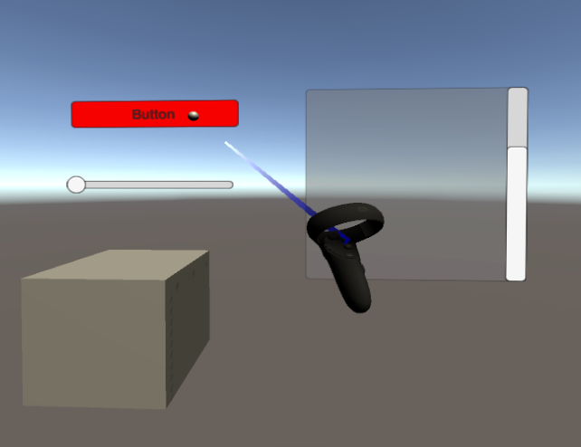

# [DebugScene](../DemoScenes.md).Raycasting

*Located in YVR/Scenes/Raycasting.scene*

* SeeAlso :
  * [YVRInputModule](xref:YVR.Core.YVRInputModule)
  * [YVRRaycastLaserBeam](xref:YVR.Core.YVRRaycastLaserBeam)

---

Raycasting scene is used to illustrate how to interact with UGUI and Physical Collider while using VR controllers.

While ray hit target object, the cursor (indicated by a sphere by default) will be at the place when ray intersects with the object.

The cube placed in the scene is used for debugging physics raycasting function.

Three different UI elements, button / slider / scroll, placed in the scene are used for debugging UI raycasting function.
