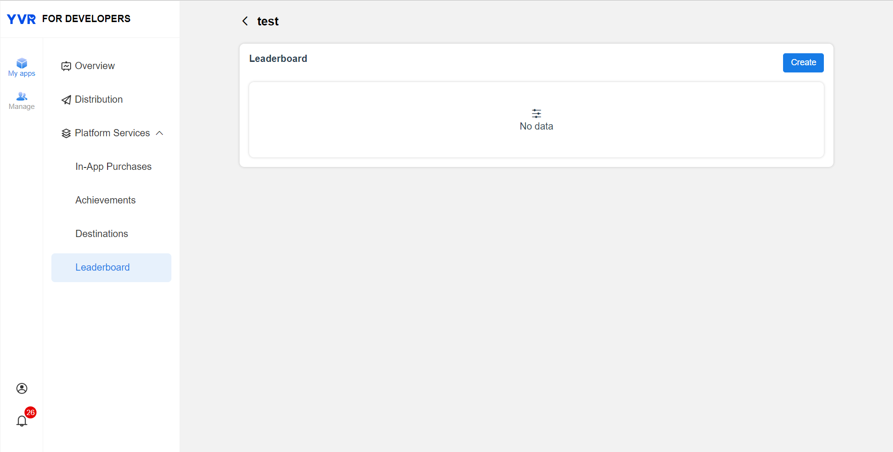

# Leaderboard

Leaderboard is a way to keep track of players and their scores in relation to other in a game. This creates competition among users and promotes user interactions. As such, it increases user activeness and engagement among them. YVR's leaderboard offers the following features：

- Auto Ranking Calculation
- Retrieve Leaderboard Data
- Update Leaderboard Data

## Create a Leaderboard

To create a leaderboard in YVR Developer Center, please refer to the following steps:

1. Log in to [Management Center | YVR Developer Platform (yvrdream.com)](https://developer.yvrdream.com/yvrdev/all_apps).

2. Select the app that is set to use the leaderboard. Enter the app page. 

3. Click Platform Service - Leaderboard on the left navigation panel.

4. Click Create. This leads you to the following interface:

5. Open the page of the created Leaderboard. Parameter descriptions are the following:

    | **Parameter**  | **Description**|
    | :------------: | :------------- | 
    | API Name      | An unique string that you will allow you to reference this leaderboard in your app code. The API Name is case-sensitive, allows numbers and "_", does not allow special characters and spaces, with maximum 20 characters. This cannot be modified after submission. The name you define in the Dashboard must exactly match the name you reference in your code. An app can create multiple leaderboards, but not same API name in the same app. |
    | Title         | Enter a Title for your leaderboard that will display publicly. It can be in English or Chinese, symbols, spaces and maximum 50 characters. |
    | Sort Order    |  There are two options for Sort Order depending on your use-case, "Higher is Better" or "Lower is Better". |
    | Score Type    | Select a Score Type to determine how scores are displayed on Leaderboard, e.g. Distance (ft), Distance (m), Percentage (%), Point, Time (ms), and Time (s). |

6. After submission, wait for YVR leaderboard information's review approval. Leaderboard that is under reviewing can be used during development phase. Leaderboard's review must be completed before application is released on store. 

## View the Leaderboard's Data 

Current data can be retrieved and viewed, data includes users score and last updated time. There is a clear function that will remove all the entries in the leaderboard. This action is irreversible, please operate this with caution. 

## Leaderboard API

### Retrieve Leaderboard Data

| **API**       | **Description**                         |
| :------------:| :-------------------------------------- |
| YVR.Platform.Leaderboard.GetLeaderboardInfoByPage(LeaderboardByPage) | Retrieve leaderboard by page |
| YVR.Platform.Leaderboard.GetLeaderboardInfoByRank(LeaderboardByRank) | Retrieve leaderboard by rank |

### Write In Leaderboard Data

| API           | Description                             |
| :------------:| :-------------------------------------- |
| YVR.Platform.Leaderboard.LeaderboardWriteItem(LeaderboardEntry) | Write a leaderboard entry |

> [!NOTE]
> For more information, please refer to [Leaderboard API Documentation](xref:YVR.Platform.Leaderboard).