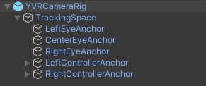

# Camera Rig

YVR Unity 软件包包含一个预制件，`YVRCameraRig`，它是整个 SDK 的核心。它还提供了对 [YVRManager](./YVRManager.md) 的访问，它是 VR 功能的主要入口。

`YVRCameraRig` 包含一个名为 `TrackingSpace` 的游戏对象，它被设计用来微调头部跟踪参考框架和你的世界之间的关系。

在 `TrackingSpace` 下，你会发现一个 `CenterEyeAnchor` 的游戏对象，它被标记为主要的 Unity 摄像机，每只眼睛有两个固定的游戏对象，分别命名为 `LeftEyeAnchor` 和 `RightEyeAnchor`，以及两个手柄的锚定对象，分别命名为 `LeftControllerAnchor` 和 `RightControllerAnchor`。

## 了解摄像机的行为

当 YVR Unity 包被导入 Unity 时，你的头戴式设备会自动将头部和手柄的跟踪参考传递给 Unity，这使 Unity 摄像机的位置和方向与你在现实世界的位置和方向相匹配。

在一些游戏中，你可能需要控制玩家角色（由摄像机识别）的移动。在这种情况下，你可以让 `YVRCameraRig` 成为一个游戏对象的子对象，并创建一个脚本来控制该游戏对象的行动。

## 在场景中添加 YVRCameraRig

`YVRCameraRig` 是 Unity 主摄像机的替代品，这意味着在 YVR 设备上构建应用程序时，应从 Hierarchy 视图中删除 Unity 的 `Main Camera` 而使用 `YVRCameraRig`。

执行以下步骤以此替换 Unity 的主摄像机 为 `YVRCameraRig`：

1. 在 Hierarchy 窗口中右击 Main Camera 游戏对象，并点击 Delete。
2. 进入 Project 选项，展开 `Packages -> YVR Core -> Prefabs` 文件夹，将 `YVRCameraRig` 预制件拖入 Hierarchy 面板。