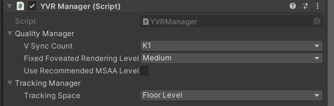

# YVRManager

[YVRManager](xref:YVR.Core.YVRManager) 脚本是整个 SDK 的核心管理程序，它控制 VR 事件功能的执行，并提供不同的渲染质量、跟踪模式、性能等设置。

## 配置设置

渲染质量、跟踪空间、性能等方面的设置可以通过 [YVRManager](xref:YVR.Core.YVRManager) 的 Inspector 面板进行设置。

### 质量

-   `VSync Count`：每一帧之间应通过的 VSyncs 数量。
-   `Fixed Foveated Rendering Level`：固定凹陷渲染的级别。该值越高，图片的边缘越模糊，但性能会越好。
-   `UseRecommendMSAALevel`：固定凹陷渲染的级别。该值越高，图片的边缘越模糊，但性能会越好。

### 追踪

-   `Tracking Space`：刚性姿势的跟踪空间。
    - `Eye Level`：HMD 姿势不会考虑地面高度。
    - `Floor Level`：大多数情况下使用的模式，它将考虑地面高度和重新定位状态。
    - `Stage`：HMD的姿势不会考虑重新定位的状态。

## 事件

在运行时发生的事件都在 [YVRManager.instance.eventsManager](xref:YVR.Core.YVREventsManager) 中管理，包括：

1.  `onTrackingAcquired`：当头部获得追踪时发生。
2.  `onTrackingLost`：当头部失去追踪时发生。
3.  `onHMDMounted`: 当 HMD 被安装到用户头上时发生。
4.  `onHMDUnMounted`：当 HMD 从用户头上取下时发生。
5.  `onRecenterOccurred`：发生在重新定位时。
6.  `onFocusGained`：当应用程序获得焦点时发生。
7.  `onFocusLost`：当应用程序的焦点丢失时发生。
8.  `onVisibilityGained`：当应用程序可见时发生。
9.  `onVisibilityLost`：当应用程序被其他内容完全遮挡时发生。
10. `onUpdate`：发生在每一帧的更新功能中。
11. `onPreSubmitGfx`：发生在当前帧被提交到本地之前，这将在渲染线程中被触发。
12. `onPostSubmitGfx`：发生在当前帧被提交到本地后，这将在渲染线程中被触发。

## 设备状态

设备状态可以在 [YVRManager.instance.hmdManager](xref:YVR.Core.YVRHMDManager) 中查询，例如：电池电量、电池温度、音量大小。

## 边界状态

所有的边界状态都可以在 [YVRManager.instance.boundary](xref:YVR.Core.YVRBoundary) 中查询，例如：边界尺寸、边界可见度。此外，[YVRManager.instance.boundary](xref:YVR.Core.YVRBoundary) 还提供了几个接口，用于查询与边界相交的状态。

